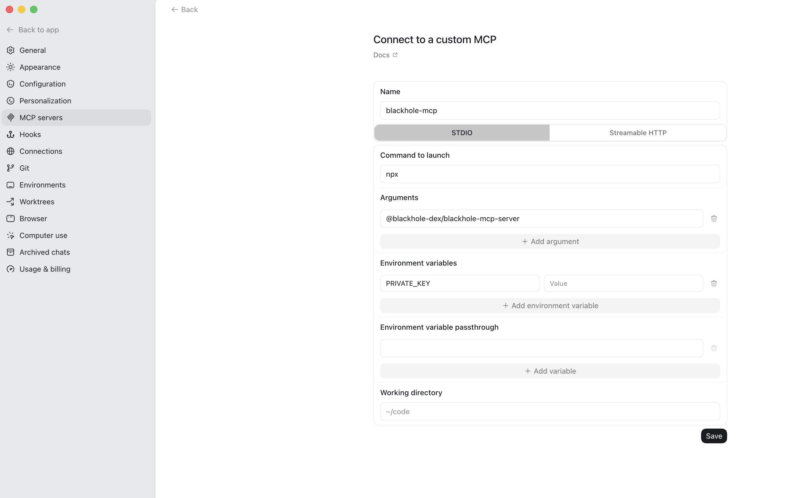

# How to use Blackhole MCP

Blackhole MCP is a [Model Context Protocol](https://modelcontextprotocol.io/) server for Blackhole DEX on Avalanche. It exposes **48 tools** so AI agents can quote swaps, plan liquidity and zaps, manage veNFT locks and votes, claim rewards, inspect pool and portfolio state, estimate gas, and optionally broadcast prepared transactions.

Supported clients include **Cursor**, **Claude Desktop / Claude Code**, **Codex**, and any MCP host that runs stdio servers. You can also embed the server in your own Node app via `createMcpServer()`.

## Quick start

### Cursor (`.cursor/mcp.json`)

```json
{
  "mcpServers": {
    "blackhole-dex": {
      "command": "npx",
      "args": ["@blackhole-dex/blackhole-mcp-server"],
      "env": {
        "PRIVATE_KEY": "0x..."
      }
    }
  }
}
```

Restart or reload MCP after saving. The agent can then call Blackhole tools in chat. `PRIVATE_KEY` is optional — include it only if you want `execute_transactions` to broadcast signed txs to Avalanche C-Chain.

### Claude Code

**From npm (recommended):**

```bash
claude mcp add --scope user blackhole-dex -- npx @blackhole-dex/blackhole-mcp-server
```

**From JSON:**

```bash
claude mcp add-json blackhole-dex '{
  "command": "npx",
  "args": ["@blackhole-dex/blackhole-mcp-server"]
}'
```

Add `PRIVATE_KEY` in the JSON `env` block if you want the agent to sign and **broadcast transactions to Avalanche C-Chain** on your behalf (via `execute_transactions`).

### Claude Desktop

Edit `~/Library/Application Support/Claude/claude_desktop_config.json` (macOS) or `%APPDATA%\Claude\claude_desktop_config.json` (Windows):

```json
{
  "mcpServers": {
    "blackhole-dex": {
      "command": "npx",
      "args": ["@blackhole-dex/blackhole-mcp-server"]
    }
  }
}
```

Restart Claude Desktop after editing.

### Codex

Codex reads MCP config from `~/.codex/config.toml` (global) or `.codex/config.toml` (project-scoped, trusted projects only). The CLI and IDE extension share this file. See the [Codex MCP docs](https://developers.openai.com/codex/mcp) for details.

**Option A — Codex app / IDE (UI)**

1. Open **Settings** (gear icon) in the Codex app or IDE extension.
2. Go to **MCP settings** and add a server (or choose **Open config.toml** and paste the TOML from Option C below).
3. Set the command to `npx` with args `@blackhole-dex/blackhole-mcp-server`, and add `PRIVATE_KEY` under environment variables if you want to broadcast transactions to the blockchain.



**Option B — CLI**

```bash
codex mcp add blackhole-dex --env PRIVATE_KEY=0x... -- npx @blackhole-dex/blackhole-mcp-server
```

In the Codex TUI, use `/mcp` to verify the server is active.

**Option C — manual `config.toml`**

```toml
[mcp_servers.blackhole-dex]
command = "npx"
args = ["@blackhole-dex/blackhole-mcp-server"]

[mcp_servers.blackhole-dex.env]
PRIVATE_KEY = "0x..."
```

## Setting up MCP with Cursor (from source)

_A similar approach can be used for Claude and Codex as well._

Use this only if you run the server from a local repo checkout.

```bash
git clone https://github.com/BlackHoleDEX/mcp-server.git
cd mcp-server
yarn install
```

```json
{
  "mcpServers": {
    "blackhole-dex": {
      "command": "bash",
      "args": ["-lc", "cd /path/to/mcp-server && NODE_ENV=prod npx tsx src/index.ts"],
      "env": {
        "PRIVATE_KEY": "0x..."
      }
    }
  }
}
```

## Install from npm (optional)

You do **not** need this for Cursor/Claude when using `npx` in MCP config.
Install only if you want local package usage (for example, importing in your own Node runtime):

```bash
npm install @blackhole-dex/blackhole-mcp-server
```

Exports: `createMcpServer`, `toolDefinitions`, `toolHandlers`.

## Using Blackhole MCP in your own agent runtime

```ts
import { createMcpServer } from "@blackhole-dex/blackhole-mcp-server";
import { StdioServerTransport } from "@modelcontextprotocol/sdk/server/stdio.js";

const server = createMcpServer();
const transport = new StdioServerTransport();
await server.connect(transport);
```

## Wallet context (`userAddress`)

Many tools need a wallet address.

| Setup | Behavior |
| --- | --- |
| `PRIVATE_KEY` set | Derives `userAddress` for portfolio and planning; `execute_transactions` can sign and broadcast to Avalanche C-Chain. |
| `USER_ADDRESS` only | Read-only default when no private key is configured. |
| Neither | Pass the wallet in the tool call or in the prompt (e.g. `0x1234...abcd`). |

Example prompts:

- "Show balances and positions for wallet `0x1234...abcd`."
- "Scan `0x1234...abcd` for missed votes, expiring locks, and out-of-range CL positions."
- "Claim voting rewards for lock tokenId `42` on wallet `0x1234...abcd`."

Step tools return compact `{ to, data, value }` payloads by default. Pass `mcp_debug: true` when you need full ABI/function metadata for debugging.

## Example prompts

### Trading and routing

- "Quote 100 AVAX to USDC with split routes and explain the route."
- "Generate swap steps for 50 AVAX → USDC with a conservative minimum output."
- "Compare single-route vs split-route for swapping 250 USDC to WAVAX."

### Liquidity (V2 and CL)

- "Add liquidity to the AVAX-USDC volatile pool with these amounts and min bounds."
- "Remove 50% of my LP from pool `0x...` and show the steps."
- "Withdraw all liquidity from my staked V2 position in pool X."
- "Add concentrated liquidity between ticks for WAVAX/USDC and simulate APR first."
- "Create a new CL pool for TOKEN_A/TOKEN_B at initial price 1.5."

### Zaps and staking

- "Create a zap split plan to enter AVAX-USDC with 1,000 USDC only."
- "Zap 500 USDC into a CL position around the current price, then stake it."
- "Zap out of my CL position tokenId `123` into AVAX only."
- "Stake my LP in pool `0x...`" / "Unstake my gauge position."

### Rewards and claims

- "Show claimable fees, emissions, and voting rewards for my wallet."
- "Build claim steps for all pending emissions."
- "Fetch voting-rewards claim payload for lock tokenId `42` and generate claim steps."

### Governance (locks, votes, gauges, bribes)

- "Show my veNFT locks and whether any are unvoted or expiring soon."
- "What epoch are we in and how much time is left to vote?"
- "Show the top gauges by vAPR for voters, but exclude tiny pools/gauges with very low existing votes"
- "For my lock `123`, what is the best way to vote this epoch to maximize rewards?"
- "Inspect lock tokenId `99`: voting power, pool weights, carry-forward status."
- "Reset votes on lock `5` and re-vote across these three pools with new weights."
- "Vote for gauges [`0xGaugeA`, `0xGaugeB`, `0xGaugeC`] with weights 50 / 30 / 20 for my lock `5`."
- "Create a gauge for this pool and add a USDC bribe for the epoch."

### Portfolio, pools, and analytics

- "Show my balances, LP positions, staked amounts, and lock NFTs."
- "Top 10 pools by LP APR and TVL — basic pools only."
- "Full status for pool `0x...`: gauge, bribes, staked vs unstaked TVL, emissions."
- "Who are the top LP providers in this pool?"
- "List active Steer/Gamma ALM vaults on Blackhole."
- "BLACK tokenomics: supply, circulating, and next 10 epochs of emissions."
- "Convert tick `-276324` to price for this CL pool" / "What tick is price 1.02?"

### Safety and operations

- "Check my token allowances for router, NFPM, and gauge manager before swapping."
- "Estimate total AVAX gas for these three prepared transactions."
- "Scan my wallet for actionable issues before the epoch ends."

### Broadcasting to chain

- "After I approve these exact steps, broadcast the prepared transactions to Avalanche with confirm."

## Tools (48)

### Trading

| Tool | Purpose |
| --- | --- |
| `quote` | Price and route quotes (including split-route options). |
| `swap_steps` | Approve + swap transaction steps for Router V2 (optional split). |

### Liquidity — V2

| Tool | Purpose |
| --- | --- |
| `add_liquidity_steps` | Add liquidity to volatile or stable V2 pairs. |
| `remove_liquidity_steps` | Remove LP from a V2 pool. |
| `withdraw_liquidity_steps` | Withdraw staked V2 liquidity from gauge. |

### Liquidity — concentrated (CL)

| Tool | Purpose |
| --- | --- |
| `add_liquidity_cl_steps` | Add or adjust CL position via NFPM. |
| `create_cl_pool_steps` | Deploy a new CL pool via custom pool deployer. |

### Deposit math

| Tool | Purpose |
| --- | --- |
| `get_deposit_amounts` | Given one token amount, compute the paired amount needed for V2 or CL liquidity entry. |

### Zaps

| Tool | Purpose |
| --- | --- |
| `zap_split_plan` | Plan optimal token split before LP/CL entry. |
| `zap_add_liquidity_steps` | Zap single token into V2 LP. |
| `zap_mint_cl_steps` | Zap into new CL position. |
| `zap_increase_liquidity_steps` | Zap into existing CL position. |
| `zap_remove_liquidity_steps` | Zap out of LP/CL to a single token. |

### Staking

| Tool | Purpose |
| --- | --- |
| `stake_liquidity_steps` | Stake LP in gauge. |
| `unstake_liquidity_steps` | Unstake LP from gauge. |

### Rewards

| Tool | Purpose |
| --- | --- |
| `claim_fees_steps` | Claim trading fees |
| `claim_emissions_steps` | Claim gauge emissions. |
| `claim_rebase_steps` | Claim veNFT rebase (anti-dilution) rewards from RewardsDistributor. |
| `claim_voting_rewards_steps` | Claim voting/bribe rewards (step builder). |
| `claim_voting_rewards_payload` | Fetch veNFT API rewards and build `claimBribes` payload. |

### Locks (veNFT)

| Tool | Purpose |
| --- | --- |
| `create_lock_steps` | Create new veNFT lock. |
| `increase_lock_steps` | Add tokens to existing lock. |
| `merge_lock_steps` | Merge two locks. |
| `lock_advanced_steps` | Advanced lock actions (extend, permanent, SMNFT, etc.). |

### Voting and epoch

| Tool | Purpose |
| --- | --- |
| `vote_steps` | Vote, reset, or poke veNFT on voterV3. |
| `get_lock_vote_state` | Full state for one lock: power, allocations, carry-forward, last vote. |
| `vote_leaderboard` | Gauge leaderboard for **voters** (vAPR, vote weight, bribes). |
| `get_epoch_state` | Current epoch timing and scheduled BLACK emissions. |

### Gauges and bribes

| Tool | Purpose |
| --- | --- |
| `create_gauge_steps` | Create gauge for a pool. |
| `add_bribes_steps` | Deposit bribes on a bribe contract. |

### Portfolio and discovery

| Tool | Purpose |
| --- | --- |
| `resolve_address` | Resolve protocol, pool, gauge, bribe, and reverse gauge -> pool addresses. |
| `get_token_balances` | ERC20 balances for a wallet. |
| `get_user_positions` | LP, staked, and CL positions. |
| `get_user_locks` | veNFT locks for a wallet. |
| `get_whitelisted_tokens` | Tokens whitelisted on the DEX. |
| `get_opportunities` | Actionable scan: expiring locks, unvoted locks, out-of-range CL, unclaimed rebase. |

### Pools, yield, and ALM

| Tool | Purpose |
| --- | --- |
| `pool_yield` | Ranked pools by **LP** APR, TVL, fees (for liquidity providers). |
| `get_pool_status` | Deep snapshot for one pool: gauge, TVL, votes, bribes, ALM, liquidity breakdown. |
| `get_pool_lp_providers` | Top LPs by TVL share for a pool. |
| `get_alm_vaults` | Steer and Gamma ALM vaults on Blackhole pools. |
| `get_tokenomics` | BLACK supply, circulating, market cap, emissions schedule. |

### CL math and simulation

| Tool | Purpose |
| --- | --- |
| `cl_tick_to_price` | Convert tick to human price. |
| `cl_price_to_tick` | Convert price to tick. |
| `cl_position_detail` | Position liquidity, range, and amounts in pool. |
| `cl_apr_simulator` | Simulate CL APR for a range and deposit size. |

### Operational / safety

| Tool | Purpose |
| --- | --- |
| `get_allowances` | ERC20 allowances vs router, NFPM, voting escrow, etc. |
| `estimate_gas_and_tx_cost` | Gas and AVAX cost for one or more `{ to, data, value }` calls. |

### Broadcasting to chain

| Tool | Purpose |
| --- | --- |
| `execute_transactions` | Sign and broadcast prepared transactions to Avalanche C-Chain when `PRIVATE_KEY` is set and `confirm: true`. |

> **LP vs voter yield:** Use `pool_yield` and `cl_apr_simulator` when the user supplies **liquidity**. Use `vote_leaderboard` and **vAPR** when the user **locks BLACK** and allocates **vote weight** — voter rewards divide by vote weight on the gauge, not pool TVL.

## Optional environment variables

Defaults cover Avalanche mainnet RPC and subgraphs. Override only when needed.

| Variable | Purpose |
| --- | --- |
| `RPC_URL` | Avalanche C-Chain JSON-RPC for reads, simulation, and broadcasting transactions. |
| `BASIC_GRAPH_URL` | Subgraph for basic (V2) pools. |
| `CL_GRAPH_URL` | Subgraph for CL pools and portfolio data. |
| `GAMMA_VAULT_ADDRESSES` | Comma-separated Gamma vault allowlist override. |
| `PRIVATE_KEY` | Signs and broadcasts via `execute_transactions`; also derives default `userAddress`. |
| `USER_ADDRESS` | Read-only default `userAddress` when no private key is set. |

**Cursor** — `env` on the server entry:

```json
{
  "mcpServers": {
    "blackhole-dex": {
      "command": "npx",
      "args": ["@blackhole-dex/blackhole-mcp-server"],
      "env": {
        "RPC_URL": "https://api.avax.network/ext/bc/C/rpc",
        "CL_GRAPH_URL": "https://your-subgraph.example.com/...",
        "PRIVATE_KEY": "0x..."
      }
    }
  }
}
```

## Environment and safety notes

- **Network:** Avalanche mainnet when using default prod config and RPC.
- **Review before broadcast:** Verify wallet, tokens, amounts, recipient, slippage, and pool addresses.
- **Broadcasting:** `execute_transactions` submits signed transactions to Avalanche C-Chain only when you call it with `confirm: true` and a configured `PRIVATE_KEY`.
- **Secrets:** Never commit `PRIVATE_KEY`, share config on multi-user machines, or log env values.
- **Votes:** Votes carry forward each epoch automatically; re-vote only when changing allocations (`get_opportunities` explains common cases).
